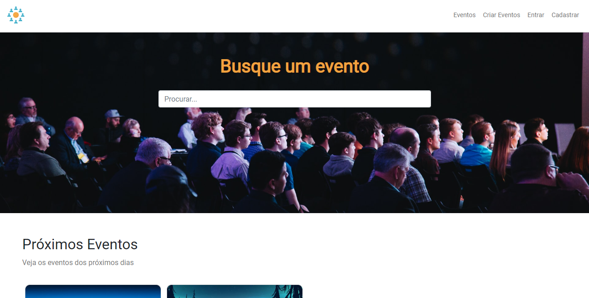

<h1 align="center"> Hdc-Events </h1>

Aplicação de eventos criada para poder praticar o conhecimento adquirido da tecnologia Laravel.  

  <a href="#-tecnologias">Tecnologias</a>&nbsp;&nbsp;&nbsp;|&nbsp;&nbsp;&nbsp;
  <a href="#-projeto">Projeto</a>&nbsp;&nbsp;&nbsp;|

  

 

  

## 🚀 Tecnologias

Esse projeto foi desenvolvido com as seguintes tecnologias:

- HTML e CSS
- JavaScript
- PHP
- Blade
- Laravel
- Git e Github

## 💻 Projeto

Página criada com o intuito de criar boas práticas nos conceitos avançados de PHP e Laravel.

[Visite o projeto online](https://danrodriguezdev.github.io/HdcEvents/)
